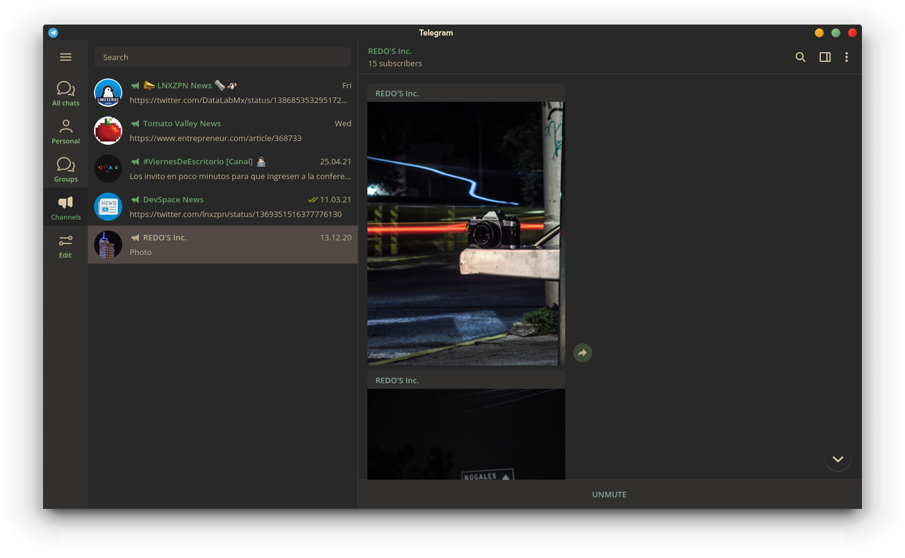

# Gruvbox Theme for Telegram Desktop

This repo contains a gruvbox theme for telegram desktop.

Forked from https://github.com/gilbertw1/telegram-gruvbox-theme

I modified some settings to fit better with my current Gruvbox desktop color scheme and replaced the sidebar background with one more suitable for Gruvbox

## Preview



## Install

1. Create zip

	```
	$ make [THEME=<theme file>] [BACKGROUND=<background file>]
	```

	You can use the `THEME` variable to set the name of the resulted theme
	file and `BACKGROUND` to specify the background file.

	Correct values for `BACKGROUND`:

	* `tile.jpg`
	* `tile.png`
	* `background.jpg`
	* `background.png`

2. Send zip file to yourself (or someone else)

3. Click on file to install theme
